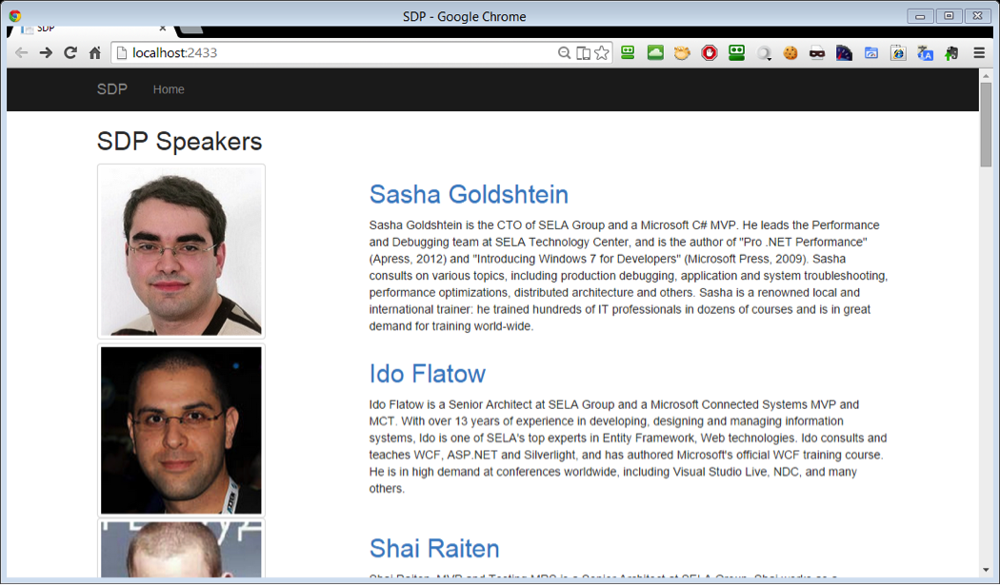

### Capturing Dump Files with DebugDiag

In this lab, you will configure DebugDiag to generate a dump automatically when there is a specific .NET exception in the IIS Worker Process. DebugDiag will also generate a basic triage report that you can use to bootstrap your analysis of this issue.

#### Task 1

Open the [SDPApp.sln](src/SDPApp.sln) solution in Visual Studio. Build and run the web application and make sure it displays a list of conference speakers. You might need to manually restore NuGet packages for the solution.

 
> The rest of the lab assumes are you using IIS Express, which is the Visual Studio default web server, but it’s also OK if you deploy the application to a full IIS instance. Just make sure to use w3wp.exe instead of iisexpress.exe when configuring the dump rules.

#### Task 2

From the Start menu, run **DebugDiag 2.0 Collection**. Use the wizard to create a new crash rule. In the target type selection dialog, pick **A specific process** and on the next screen select the iisexpress.exe process. (If you deployed the application to a full IIS instance, you should pick the appropriate w3wp.exe process, or pick **All IIS/COM+ related processes** on the previous screen.)

In the **Advanced Settings** section, click **Exceptions** and then click **Add Exception**. Select **CLR (.NET) 4.x Exception** and in the exception type textbox type **System.ApplicationException**. In the action type dropdown select **Full Userdump**.

After you save all configuration settings, DebugDiag will monitor the web application and generate a dump file when an `ApplicationException` object is thrown.

#### Task 3

Click the **Sasha Goldshtein** link in the web application. An error message is displayed. Behind the scenes, an application was thrown but the web application doesn’t display error specifics (which is the right behavior for a production service).

Go back to the DebugDiag window and make sure the **Userdump Count** column indicates there is (at least) 1 dump.

Open the Start menu and run **DebugDiag 2.0 Analysis**. Check the **Crash/Hang Analysis checkbox**, and click **Add Data Files** on the bottom of the screen. Navigate to the folder where the dump file was generated (by default it should be under **C:\Program Files\DebugDiag\Logs\YOUR RULE NAME**), and select the dump file. Then, click **Start Analysis**.

Review the analysis report and make sure you see the precise exception stack trace and understand where to look next to determine what caused the error.
