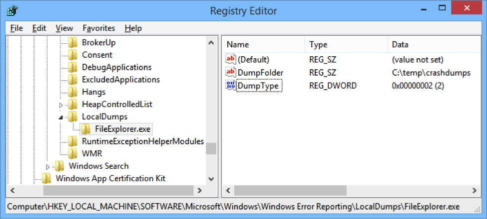

### Generating Dump Files Automatically with WER

In this lab, you will configure Windows Error Reporting to generate dumps automatically when a specific application crashes. Then, you will analyze the resulting dumps using Visual Studio and WinDbg.

#### Task 1

> Exercise caution when editing the Windows registry. If you are not sure what you're doing, make sure to have a backup or use a virtual machine that you don't mind destroying.

Navigate to the registry key **HKLM\SOFTWARE\Microsoft\Windows\Windows Error Reporting\LocalDumps**. If the **LocalDumps** key doesn’t exist, create it. Under the **LocalDumps** registry key, create another key called **FileExplorer.exe**.

Under the **FileExplorer.exe** key, create the following values:

* **DumpFolder** of type REG_SZ (string) with the value **C:\Temp\CrashDumps**
* **DumpType** of type REG_DWORD with the value `2`
 

#### Task 2

Run the FileExplorer.exe application from the [bin](bin/) folder. It crashes after a few seconds without ever initializing properly. Navigate to the **C:\Temp\CrashDumps** folder and make sure a dump file was created.

> You can use the same registry configuration for any crashing process, including the IIS Worker Process (w3wp.exe). In fact, if you place the **DumpFolder** and **DumpType** values directly under the **LocalDumps** key, they will apply to every crashing application that doesn't have custom error reporting. Notably, .NET 2.0 applications are not covered by this registry key.

In the [next lab](../dbg-dumps-vs/), you will learn how to analyze the dump file you just generated.
