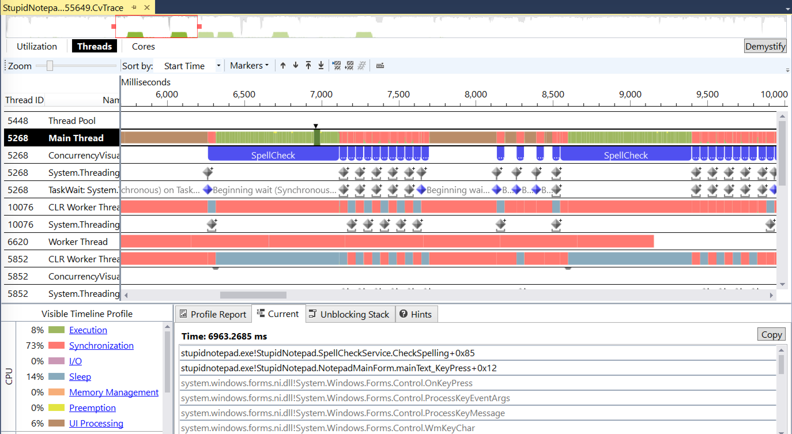

### Analyzing UI Delays with the Visual Studio Concurrency Visualizer

In this lab, you will use the Visual Studio Concurrency Visualizer to analyze and pinpoint UI delays in an application and determine why it enters a wait.

#### Task 1

Run the StupidNotepad.exe application from the [bin](perf-perfview-cpu/bin/) folder and start typing some text into the edit box. You'll notice that the UI occasionally stutters and stops responding for short periods of time. If you open a Task Manager window and inspect the CPU utilization at the same time, you will also notice CPU usage spikes when typing into the application.

#### Task 2

Run Visual Studio and open the [StupidNotepad.sln](perf-perfview-cpu/src/StupidNotepad.sln) solution. Compile and run the project to make sure you can reproduce the same issue.

In Visual Studio, click **Analyze** > **Concurrency Visualizer** > **Start with Current Project**.

> If you do not have the Concurrency Visualizer menu item, you need to install it (it is a Visual Studio extension) from the [Visual Studio Gallery](https://visualstudiogallery.msdn.microsoft.com/a6c24ce9-beec-4545-9261-293061436ee9). Make sure to install the version matching your Visual Studio version. Note that Concurrency Visualizer also supports attaching to a running process.

Reproduce the bug by typing into the UI until you experience multiple delays, and then close the application. The Concurrency Visualizer report will appear after symbols are loaded and all events are parsed.

Explore the main view and then click **Threads** to see the application's threads. Each row in the chart is a thread (or some kind of activity source), and the various colors illustrate what the thread was doing over time. At the bottom of the screen you can find a legend describing the various colors. You can also zoom in and out of the timeline, and click a particular region of activity to see what the thread was doing -- including its call stack!

You can now identify the source for the UI delays. Look at the regions where the main thread is busy with work other than UI processing. Click these regions to see what the thread was doing -- whether it was active CPU work or waiting for some other thread to complete.

