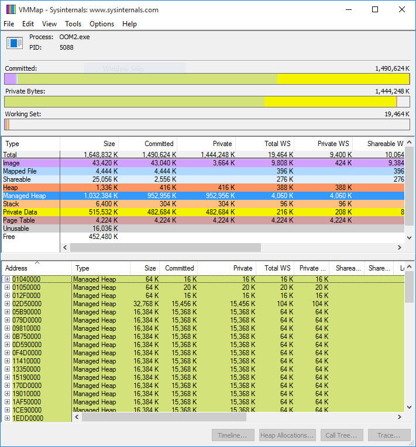

### Inspecting GC Segments and Fragmentation

In this lab you will experiment with Sysinternals VMMap to inspect GC segments and address space fragmentation.

#### Task 1

Run the OOM2.exe application from the [bin](bin/) folder. After a few seconds, it crashes with an `OutOfMemoryException` error. Do not close the Windows Error Reporting window -- move it aside, but leave the process in a running state.

Run Sysinternals VMMap (VMMap.exe) from the [tools](../tools/) folder. When prompted to select a process, select the OOM2.exe process. In the resulting window, review the summary table and determine how much virtual memory is still available for allocations (under the **Free** category). Surprisingly, even though there seems to be a lot of available memory, the application still fails to allocate more memory.

Click the **Managed Heap** row and review the GC segments in the detailed table on the bottom. Note that most GC segments have a uniform size. The specific size may depend on your version of the CLR. The question, then, is whether there is sufficient memory available to allocate an additional segment.

Click the **Free** row in the table and sort the detailed table on the bottom by region size. What is the largest free region avaialble for allocation? If this is smaller than the GC segment size, then you know why the application failed to allocate more memory. Even if the requested allocation was small, the address space is sufficiently fragmented such that another GC segment cannot be reserved.

As a bonus, take a look at the address space visualization under **View** > **Fragmentation View**. This address space is like a good Swiss cheese, full of small holes. 