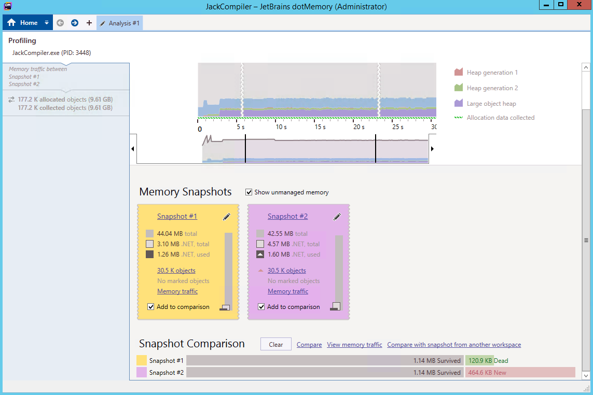

### Analyzing Memory Traffic with dotMemory

In this lab, you will analyze an application's memory traffic (allocation behavior) using JetBrains dotMemory (a commercial profiler). To analyze memory traffic, dotMemory hooks the application's memory allocations and aggregates the types allocated with the stack traces that performed the allocation. This can be used to identify hotspots in your application that are responsible for creating lots of garbage for the GC to reclaim, which can be a significant resource hog.

#### Task 1

If you haven't yet, install [JetBrains dotMemory](https://www.jetbrains.com/dotmemory/). Run dotMemory and choose **Local** to launch the application under the profiler. This is required because collecting memory allocation events (memory traffic) doesn't work when attaching to an already-running process.

> If you're interested in a more lightweight allocation profiling approach that works with already-running processes, consider using [PerfView allocation sampling](../perf-perfview-netallocs), which relies on built-in CLR ETW events for allocation sampling.

Specify the JackCompiler.exe application from the [bin](../perf-perfview-netallocs/bin) folder as the target, and make sure to check **Advanced** and provide BigProgram.jack as the application's command line argument. Also make sure the working directory is where the BigProgram.jack file resides (next to the JackCompiler.exe file). Finally, click **Run** to launch the application.

After a few seconds, click **Get snapshot** to get a snapshot of the application's heap; and then again after a few seconds. You will be looking at the memory traffic between these two snapshots. At this point, you can kill the target process.

#### Task 2

In the dotMemory viewer, scroll to the bottom of the screen and click **View memory traffic**.

A summary of allocated types and sizes should appear, including a list of specific types and the number of bytes allocated. Strings should be dominant; if you click the `String (System)` row, you will be able to see the call stacks leading up to these allocations. The stack is fairly simple, and if you look at the [source code](../perf-perfview-netallocs/src), it is also fairly easy to eliminate the excessive allocations.

#### Bonus

Modify the source code to get rid of the excessive allocations and try running the application again under dotMemory to confirm that the allocations have been reduced.
