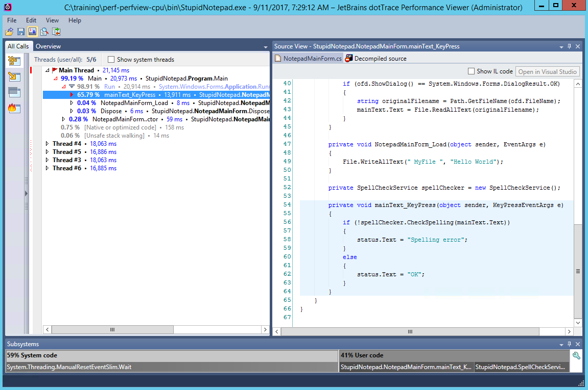

### Profiling CPU Work by Sampling with dotTrace

In this lab, you will use JetBrains dotTrace (a commercial profiler) to analyze the on-CPU behavior of a .NET application in sampling mode. When run in sampling mode, dotTrace periodically captures a sample of each thread's call stack and displays a summary report at the end of the run. You don't get a precise history of the number of times each function executed (by nature of sampling), but the results are usually fairly accurate to determine where the bottlenecks are. Furthermore, the
expected slowdown of your application is fairly low (usually up to 10%).

#### Task 1

If you haven't yet, install [JetBrains dotTrace](https://www.jetbrains.com/profiler/). Run dotTrace and use the **sampling** profiling method to launch the StupidNotepad.exe application from the [bin](../perf-perfview-cpu/bin) directory. Start typing some text into the edit box. You'll notice that the UI occasionally stutters and stops responding for short periods of time. You can confirm that this is correlated with CPU spikes by using Task Manager or [performance
counters](../perf-perfcounters-gc). 

After 20-30 seconds of typing, close the application. dotTrace will open the performance report viewer with a thread summary for the results that were recorded. Explore the report for a bit before switching to the next section.

#### Task 2

Answer the following questions:

* What is the hottest path through the application?
* What blocks the main thread and causes the unresponsive UI?
* What are the background threads doing in this application?
* Which proportion of time is actually on-CPU as opposed to various kinds of blocking?
* How does dotTrace's sampling method work? (You might find [the documentation on profiling types](https://www.jetbrains.com/help/profiler/Profiling_Guidelines__Choosing_the_Right_Profiling_Mode.html) useful.)
