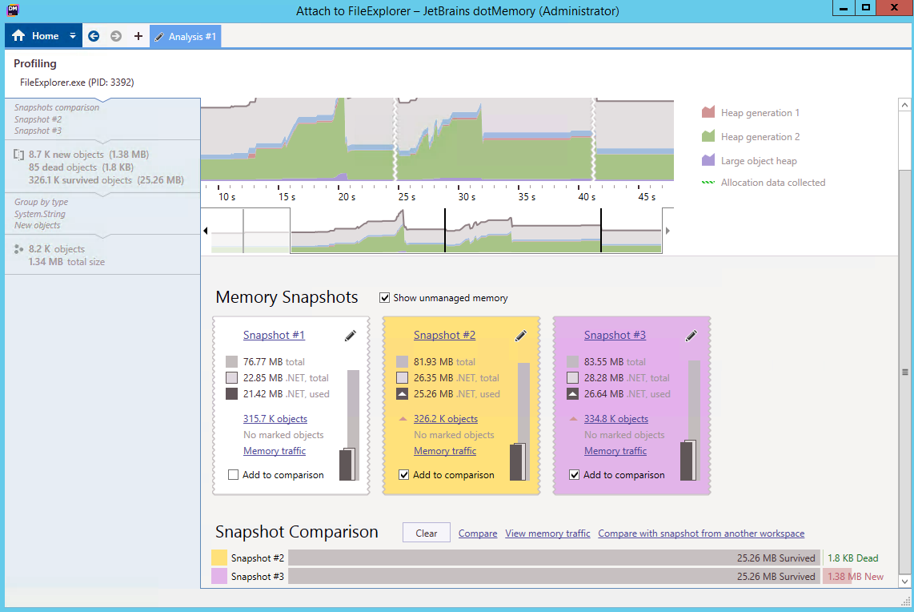
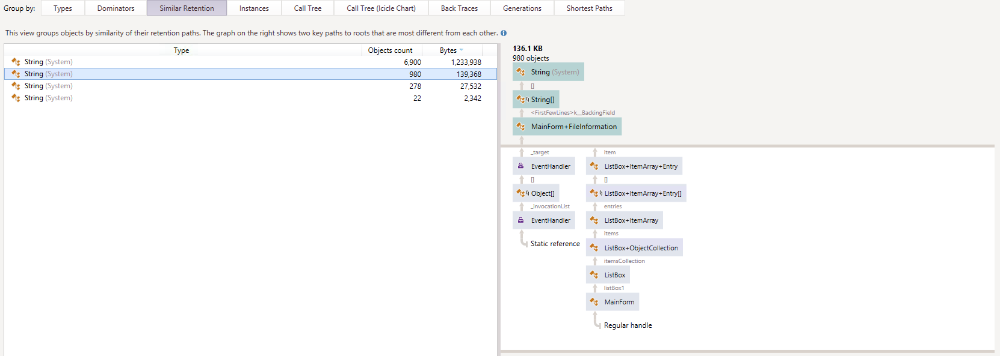

### Analyzing a .NET Memory Leak with dotMemory

In this lab, you will use heap snapshots to uncover the root cause of a .NET memory leak using JetBrains dotMemory (a commercial profiler). The snapshots technique is extremely useful and generic, and can be applied with a variety of other profilers as well.

#### Task 1

If you haven't yet, install [JetBrains dotMemory](https://www.jetbrains.com/dotmemory/). Run the FileExplorer.exe application from the [bin](../dbg-sos-leak/bin) directory. It takes a few seconds to initialize; you should launch dotMemory in the meantime. When File Explorer finishes launching, click **Attach** in the dotMemory window and select the FileExplorer.exe process. Then, click **Run** to attach the profiler.

In the resulting window, click **Get snapshot** to capture an initial snapshot of the application's heap before you do anything. Then, start expanding the folder tree in the File Explorer application -- this is something users reported as causing a memory leak. After expanding a few folders, click the **Get snapshot** button in dotMemory again. The .NET heap should be larger in the snapshot view, although perhaps only by a few hundred kilobytes. Repeat as necessary until you're convinced
that there is a formidable memory leak, and that you have snapshots before and after the leak has accumulated fully.

#### Task 2

Click **Add to comparison** under the snapshots that you'd like to compare, scroll down, and then click **Compare** to see the top accumulated types. Strings are likely to be dominant; click the **New objects** cell in the `String (System)` row to view the new string objects that were allocated between the two snapshots you selected, and not freed yet. In the resulting view, experiment with both the **Dominators** panel and the **Similar Retention** panel to understand which GC root
paths are responsible for retaining the string objects.

> The term *dominator* refers to a concept in graph theory. An object A is dominated by an object B if any path from the root(s) of the graph to object B passes through object A. In other words, removing object A from the graph is guaranteed to cause object B to become disconnected (unreferenced) as well. This is helpful when inspecting heap snapshots, because often the leaves of the graph will be generic objects like strings and arrays; you're interested in the objects further upstream
> that are responsible for retaining these leaf objects.

You should discover that there is a static event handler that retains `FileInformation` objects, which in turn retain a lot of strings. This is the underlying cause of the memory leak. You can inspect the application's [source code](../dbg-sos-leak/src) to see where the event registration occurs, and how it should be fixed.
