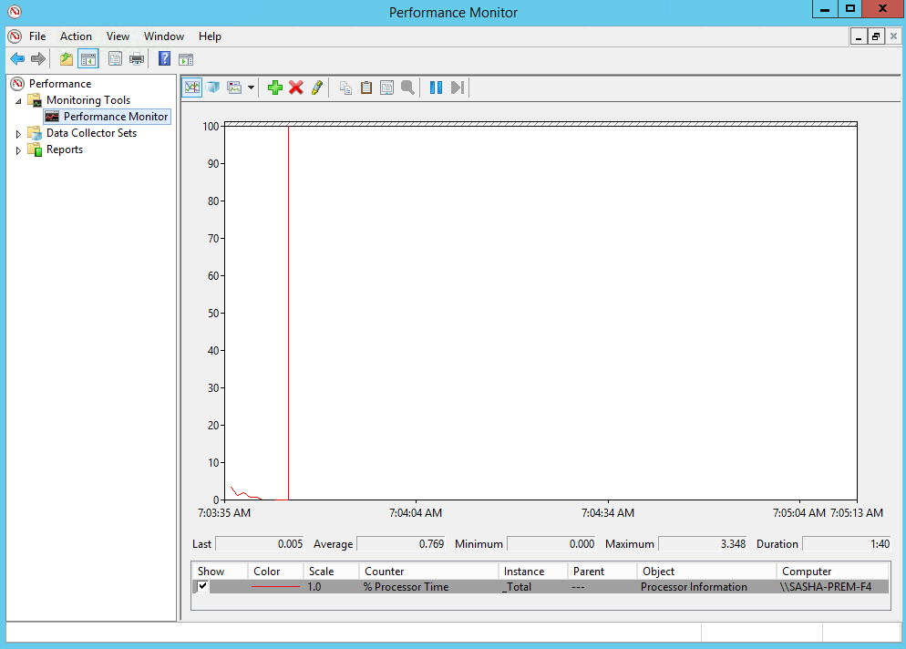

### Viewing Top-Level GC Behavior with Performance Counters

In this lab, you will use the Windows built-in `typeperf` and Performance Monitor tools to view top-level GC behavior in a .NET application. This enables continuous, low-overhead monitoring of memory-related issues, which can be escalated to more invasive investigation (such as [allocation tracing](../perf-perfview-netallocs)) if necessary.

#### Task 1

As a basic experiment with GC performance counters, we will start by live monitoring Visual Studio's GC behavior. Run Visual Studio, and then launch Windows Performance Monitor (perfmon) and navigate to the **Performance Monitor** view. By default, CPU utilization is displayed:



Click the green + button to add additional performance counters. On the left pane, navigate to **.NET CLR Memory** and expand it to view the performance counters that are available. Select all of them, and then on the bottom click **devenv** to select the Visual Studio process. click the **Add >>** button and then click **OK** to finish adding the counters. The graph will update to display the selected counter. Experiment with the different views (Line, Histogram bar, Report).

Perform some activity in Visual Studio, such as creating a new project. What is the effect on:

* % time spent in garbage collection
* The number of bytes on the managed heap
* The number of collections in each generation
* The allocation rate (bytes/second)

Explore some of the other performance counter categories in Performance Monitor. Specifically, **Processor**, **Process**, **PhysicalDisk**, and **NetworkInterface** are some interesting categories to look at for general system performance monitoring.

#### Task 2

You can also view performance counters using a scripting-friendly tool called `typeperf`. It takes a list of performance counters to display, and prints their values to the terminal every second, in CSV format. Try the following command line:

```
typeperf ".NET CLR Memory(devenv)\# Bytes in all Heaps" ".NET CLR Memory(devenv)\# Gen 0 Collections"
```

#### Task 3

Performance Monitor can also record performance counters (the counter-part command-line tool is called `logman`). In the Performance Monitor window, navigate to **Data Collector Sets** in the left-hand-side navigation bar. Under **User Defined**, you can create your own performance counter recordings that run in the background, and view them later.

Create a data collector set that monitors some application's (e.g. Visual Studio's) memory behavior. Consider recording the following metrics from the **Process** and **.NET CLR Memory** categories:

* Total virtual size
* Private bytes
* Working set
* Managed memory (GC heap)
* Managed allocation rate
* Garbage collections

Run the data collector set to capture a recording, and then view it in Performance Monitor.

> You can also export the data collector set as a template that operations personnel can apply on a production system to quickly record the metrics you're interested in.

#### Bonus

Devise your own command lines for `typeperf` to monitor the following metrics:

* Disk utilization
* Number of .NET exceptions
* Network send and receive statistics
