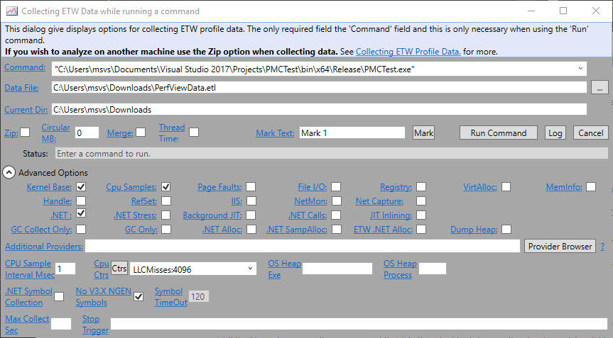
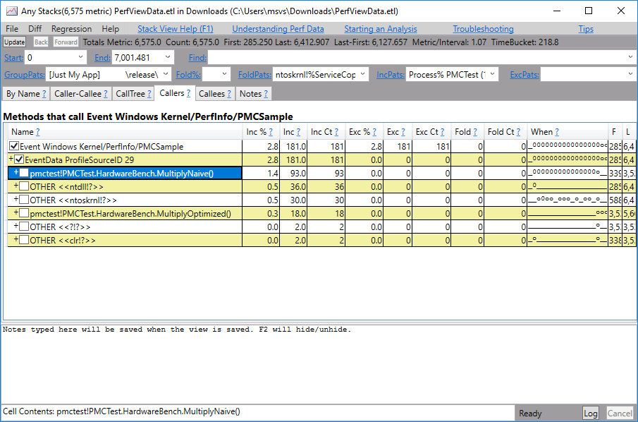
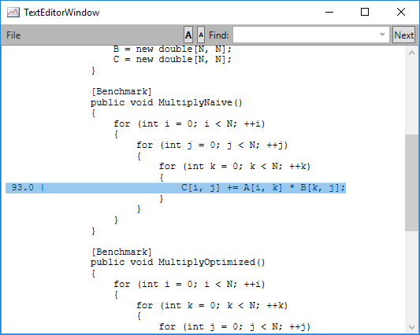

### Measuring Cache Misses with PerfView

In this lab, you will use PerfView to diagnose cache misses using PMU (Processor Monitoring Unit) events, available on some hardware platforms and accessible through ETW events.

#### Task 1

Implement a simple console application that compares the two approaches discussed in class for matrix multiplication, where reversing the loop order of the inner loop speeds up the computation considerably. To save some time, you can use the following skeleton:

```C#
public class HardwareBench
{
    private const int N = 400;
    private double[,] A, B, C;

    public void Setup()
    {
        A = new double[N, N];
        B = new double[N, N];
        C = new double[N, N];
    }

    public void MultiplyNaive()
    {
        for (int i = 0; i < N; ++i)
        {
            for (int j = 0; j < N; ++j)
            {
                for (int k = 0; k < N; ++k)
                {
                    C[i, j] += A[i, k] * B[k, j];
                }
            }
        }
    }

    public void MultiplyOptimized()
    {
        for (int i = 0; i < N; ++i)
        {
            for (int k = 0; k < N; ++k)
            {
                for (int j = 0; j < N; ++j)
                {
                    C[i, j] += A[i, k] * B[k, j];
                }
            }
        }
    }
}

class Program
{
    static void Main(string[] args)
    {
        var bench = new HardwareBench();

        bench.Setup();
        for (int i = 0; i < 10; ++i)
            bench.MultiplyNaive();

        bench.Setup();
        for (int i = 0; i < 10; ++i)
            bench.MultiplyOptimized();
    }
}
```

You can try running this program yourself to get an idea of which version is faster, but we are mostly interested in the cache miss behavior of the two loops. Make sure to build in Release mode, and for your processor's native architecture (probably x64 and not x86).

#### Task 2

> To perform this part, you need a physical host running Windows, with access to PMU events. Most virtual machine software does not virtualize the PMU by default, or virtualizes it poorly in a way that affects the measurement results. If you don't have a physical host running Windows, you can skip this lab.

Run PerfView.exe and choose **Collect** > **Run** from the menu. Specify the path to your console application, and expand the **Advanced** options. In the **Cpu Ctrs** box, make sure to select **Llc Misses** (last-level cache misses) and configure the sampling frequency to the smallest possible value (4096 on our test system). Click **Start Collection** to run the program, and wait for it to complete.



When the program completes, expand PerfView's report and choose **Advanced Group** > **Any Stacks**. Choose your process from the list, and then in the resulting view find the `Windows Kernel/PerfInfo/PMCSample` events. Double-click the line to open a tree view, and navigate through it to find which method (`MultiplyNaive` or `MultiplyOptimized`) had more cache misses.



You can even right-click a function and choose **Goto Source** for a rudimentary source browser that highlights the lines that
experienced the most cache misses.


