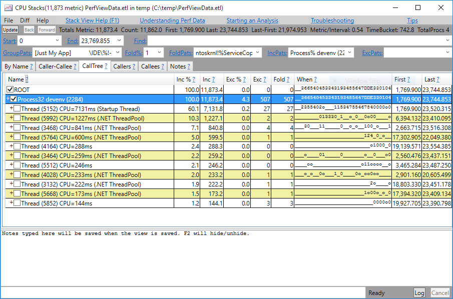

### Analyzing Startup Performance

In this lab you will analyze application startup performance using ETW events with PerfView.

#### Task 1

Before you begin, cold boot your machine and do not start any applications yet. We want to monitor the cold startup process of Visual Studio, and determine which factors contribute to its startup time.

Run PerfView.exe and choose **Collect** > **Collect**. Uncheck the **Zip** and **Merge** checkboxes to make stopping the collection a bit faster. Under the **Advanced Options** expander, check the **File I/O** and **Background JIT** checkboxes. When done, click **Start Collection** and then start Visual Studio. When the Visual Studio window appears and the UI stabilizes, go back to PerfView and click **Stop Collection**. Wait for the collection to stop.

Under the collected .etl file in the file explorer on the left, you should see a list of reports. First, let's start with understanding which files were accessed during Visual Studio's startup. Double-click **File I/O Stacks** and pick the devenv process from the list. Navigate to the **By Name** tab and determine which files were accessed a lot by Visual Studio's startup sequence. 

Next, let's take a look at which DLLs were loaded during the startup sequence. Double-click **Image Load Stacks**, select the devenv process, and switch to the **By Name** tab again to see which DLLs were loaded. Now, switch back to the **CallTree** tab and try to determine whether most of these DLLs were loaded implicitly (during loader initialization in the process) or explicitly after the main function was called.

> Remember that whenever PerfView shows question marks (?!?) instead of function names, you can force it to load symbols for that cell using Alt+S. Also, you might want to experiment with turning off grouping and/or folding.

Finally, let's take a look at CPU utilization. Perhaps some parts of the Visual Studio startup sequence are dominated by actual processing. Double-click the **CPU Stacks** report, select the devenv process, and analyze the information on the **CallTree** tab. How much time did Visual Studio spend on-CPU? What are some key functions responsible for a large amount of time on-CPU? Switch back to the **By Name** tab and choose **[group modules]** from the **GroupPats** combo box. Which non-OS modules are responsible for a large amount of CPU utilization?

#### Task 2

Go back to the main PerfView window and open the **JIT Stats** report. Navigate to the Visual Studio (devenv) process. How much time did it take to JIT the necessary code during Visual Studio startup? Which proportion of the CPU time is spent in JIT? What are the assemblies that took longest to JIT? Can some of these assemblies be NGen'd to reduce startup costs, or would the gains be insignificant?

#### Task 3

Close Visual Studio and repeat the sequence in Task 1 -- collect data with PerfView while launching Visual Studio, but check the **Thread Time** checkbox as well in the **Collect** dialog. This time, we are measuring warm startup. 

Open the **Thread Time Stacks** report, choose the devenv process, and navigate to the **By Name** tab. Which percentage of time was spent on the CPU? Which was on network or disk? If you're seeing very low disk times, that's indicative of warm startup. Go back to the **CallTree** tab and filter out everything but the startup thread -- right-click the startup thread and choose **Include Item** (Alt+I). Go back to the **By Name** tab again. Which proportion of the time did the startup thread spend on actual processing (CPU), and which part was blocked time -- waiting for something? 

Double-click the **BLOCKED TIME** entry. Expand the stack tree and try to determine what caused the Visual Studio startup thread to block during startup. 
