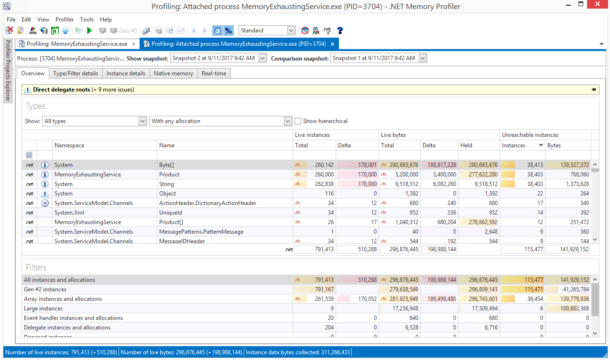
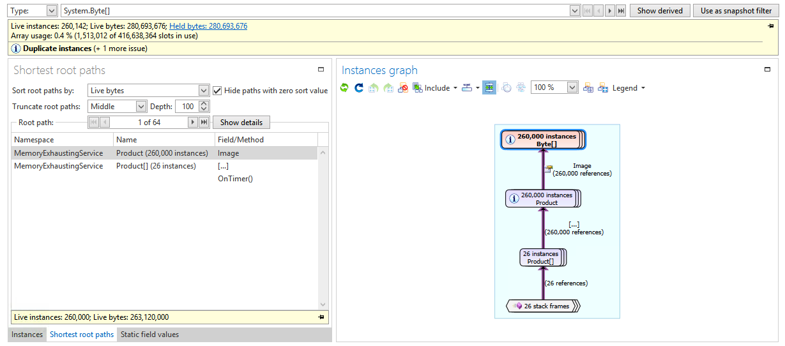

### Analyzing a .NET Memory Leak with SciTech Memory Profiler

In this lab, you will use heap snapshots to uncover the root cause of a .NET memory leak using SciTech .NET Memory Profiler (a commercial profiler). The snapshots technique is extremely useful and generic, and can be applied with a variety of other profilers as well.

#### Task 1

If you haven't yet, install [Memory Profiler](https://memprofiler.com/). Next, run the MemoryExhaustingService.exe application from the [bin](../dbg-sos-advancedleak/bin) folder. This is a WCF service that seems to be leaking memory at an alarming rate. Run .NET Memory Profiler, and click **Attaching to running process** on the main page. Select the MemoryExhaustingService.exe process, and then select **Inspection only attach** (this is a lower-overhead mode). Finally, click **Start** to
begin the profiling session.

In the real-time data screen, you can see the application's metrics in terms of .NET memory usage. Its memory usage seems to be going up -- click **Collect snapshot** to grab a heap snapshot for later analysis. You can collect multiple snapshots over a couple of minutes, and then click **Stop profiling** (or just close the MemoryExhaustingService.exe console window). The resulting report compares the last two snapshots you've captured, and shows which types had instances added or
removed, and how many bytes were added and removed between the two snapshots.

#### Task 2

Right-click the type with the most added bytes (should be `System.Byte[]`) and choose **Show type details**. Then, on the bottom, click **Shortest root paths** to see which paths on the heap graph lead to these objects. The results are sorted by the number of live instances (you can also sort by size). Regardless, the top path seems to be quite simple: a `Product` object retains a byte array, and is contained in a `Product[]`, which is in turn referenced by a local variable in the
`OnTimer` method. Judging by the fact that the local variable doesn't go away, it must mean that the method doesn't terminate -- so there's a rogue timer firing over and over, and not completing.

