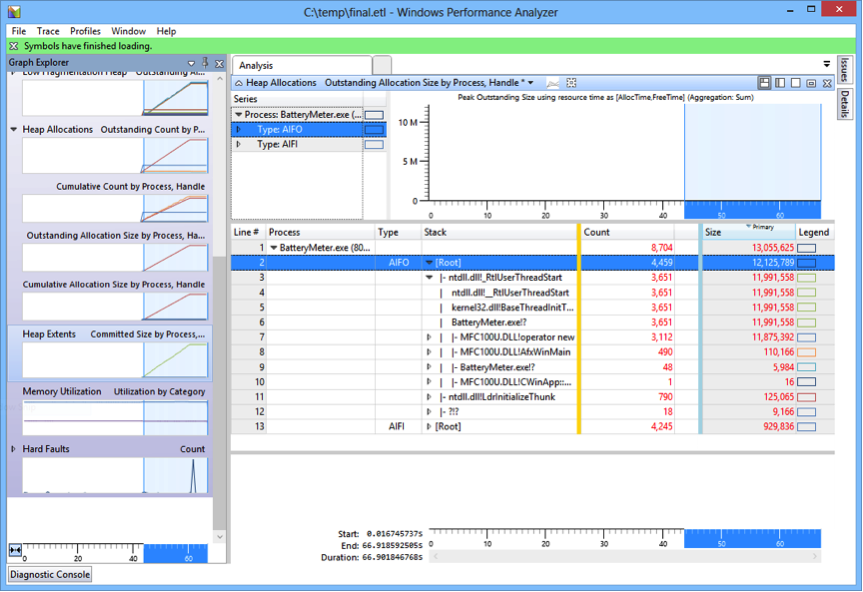

### Analyzing Unmanaged Heap Allocations with XPerf and WPA

In this lab, you will use XPerf and Windows Performance Analyzer to determine where an unmanaged application is performing heap allocations that aren't freed. In other words, you'll figure out why an application is leaking C++ heap memory while using only ETW with no invasive profilers, debuggers, recompilation, or configuration changes.

#### Task 1

Open an elevated command prompt and navigate to the Windows Performance Toolkit installation directory (under the Windows SDK installation directory, which by default is in **C:\Program Files (x86)\Windows Kits**).

Run the following commands to start capturing detailed profiling information as well as call stacks for heap allocation events. The second command will also launch the BatteryMeter.exe application from the [bin](bin/) folder:

```
xperf -on Base
xperf -start heapsession -heap -PidNewProcess "%COURSEDIR%
\perf-xperf-heapalloc\bin\Release\BatteryMeter.exe" -stackwalk HeapAlloc+HeapRealloc
```

Wait a few seconds for the application to leak some memory, and then go back to the command prompt and run the following commands to stop data collection and merge the result trace files together:

```
xperf -stop heapsession -d C:\temp\heap.etl
xperf -d C:\temp\kernel.etl
xperf -merge C:\temp\heap.etl C:\temp\kernel.etl C:\temp\combined.etl
```

While you’re waiting for the trace files to be merged, you can close the BatteryMeter.exe application.

Finally, open the C:\temp\combined.etl file in Windows Performance Analyzer (you can simply double-click the file in Windows Explorer). Make sure symbol paths are configured properly and then select **Trace > Load Symbols** and wait for symbols to fully load.

#### Task 2

In the graph view on the left, expand the **Memory** graph and then expand the **Heap Allocations** graph. Drag the **Outstanding Allocation Size by Process, Handle** graph to the main analysis pane on the right. Click the **Display Graph and Table** toolbar button on the top right.

In the table, right-click the column headers and make sure that you have the following columns displayed: **Process**, **Stack**, **Type**, **Count**, **Size**. Drag the columns so that the **Process**, **Type**, and **Stack** columns are to the left of the gold bar.

Now, start expanding the table. Specifically, you are interested most in the AIFO type (Allocated Inside Freed Outside), which represents memory allocations that have not been freed while the trace was running. If symbols were loaded successfully, you should see the allocating call stack for the majority of the oustanding allocations in the application.



You can review the application's source code (in the [src](src/) folder) to see the exact line of code that's making the leaking allocation.
